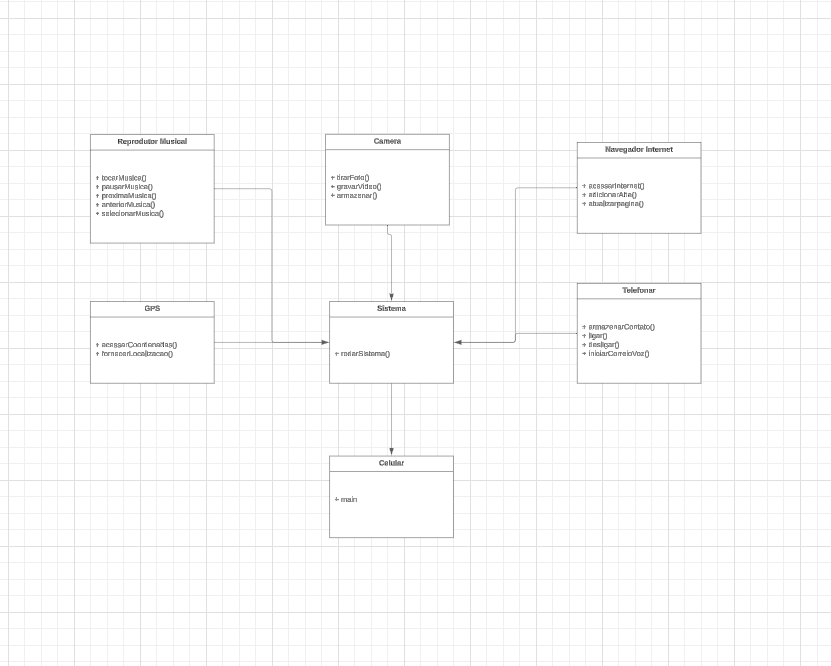

# Descrição do projeto 📚

```
Esse projeto tem como finalidade ajudar a entender os pilares da programação orientada à objetos no Java. 
Aqui poderemos perceber a utilização de interfaces, polimorfismo, herança, sobrecarga e construtores. 
Nesse projeto, utilizei alguns conceitos mais abrangentes, pois a função dele é auxiliar no aprendizado.

Ele é uma representação de como funcionavam os celulares das gerações passadas, todas as funcionalidades 
do projeto foram meticulasamente pensadas nas features das gerações passdas.
Espero que o projeto possa contribuir para a comunidade de alguma forma.

```


# UML Do Projeto 📄


